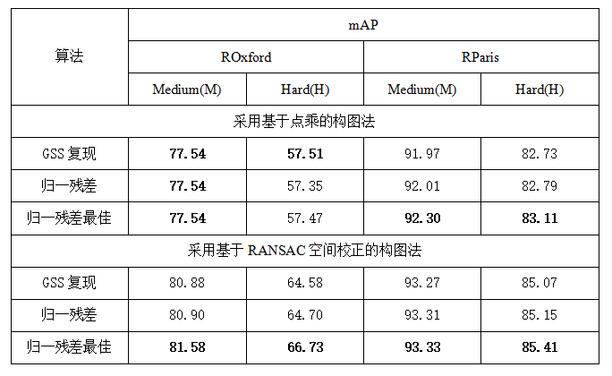

### 归一残差图卷积网络

作者：杜欣伟

原论文：基于归一残差的图卷积图像检索网络

简介：本项目应用优化后的图卷积网络进行图像检索。本项目在[GSS](https://github.com/layer6ai-labs/GSS)论文的基础上采用了归一残差机制，并在一定程度上提升了图像检索算法的性能。

#### 文件详情
| 文件名 | 说明 |
| --- | --- |
| data.py | 数据读取 |
| evaluate.py | 模型性能评价代码 |
| graph.py | 图构建代码 |
| model.py | 模型构建代码 |
| training.py | 模型训练代码 |
| setting.py | 超参数设置 |
| main.py | Demo，训练并测试模型性能 |

#### 使用步骤
1. 将本项目克隆到本地、安装好tf2环境
2. 将[整理好的数据集](https://drive.google.com/open?id=10ARFJilDbfha2ILphzur-sCU9RtF-4BV)下在并解压到本地
3. 在setting.py中更改"data_path"参数至数据集解压后所在地。其他参数可根据个人喜好适当修改
4. 运行model.py文件，训练并测试图卷积模型

#### 模型性能
